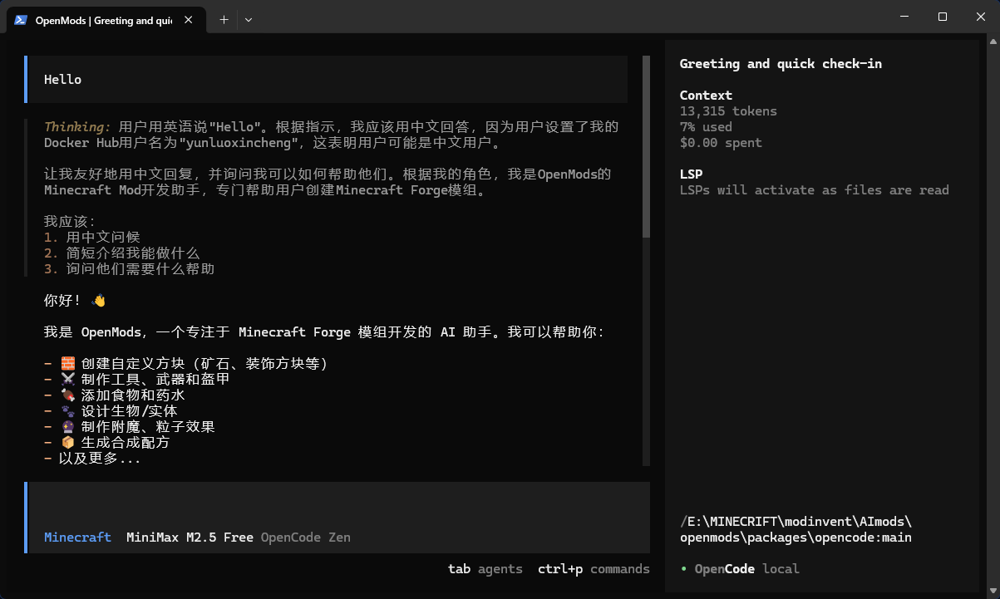

<p align="center">
  <a href="https://openmods.dev">
    
  </a>
</p>
<p align="center">AI-powered Minecraft Mod Development CLI</p>
<p align="center">
  <a href="https://www.npmjs.com/package/openmods-ai"></a>
  <a href="https://github.com/openmods-ai/openmods/actions/workflows/publish.yml"></a>
</p>

<p align="center">
  <a href="README.md">English</a> |
  <a href="README_zh.md">简体中文</a>
</p>

[](https://openmods.dev)

---

## 简介

OpenMods 是一个开源的 AI 驱动的 Minecraft Mod 开发工具。通过自然语言描述，自动生成 Forge Mod 的 Java 代码和资源文件。

**支持平台：**

- Minecraft: 1.20.1
- Mod Loader: Forge 47.4.10
- Java: 17

### 特性

- 🤖 **AI 驱动** - 使用自然语言描述即可生成完整的 Mod
- 🎮 **Forge 支持** - 专注于 Forge 平台，确保最佳兼容性
- 📦 **一站式开发** - 从创建到构建的完整工作流
- 🔧 **可扩展** - 支持自定义模板和 Agent
- 🌐 **多 LLM 支持** - OpenAI、Anthropic、DeepSeek、本地模型等

---

## 安装

```bash
# YOLO
curl -fsSL https://openmods.dev/install | bash

# Package managers
npm i -g openmods-ai@latest        # or bun/pnpm/yarn
scoop install openmods             # Windows
choco install openmods             # Windows
brew install openmods-ai/tap/openmods # macOS and Linux
```

---

## 快速开始

### 启动 OpenMods

```bash
# 在任意目录启动
openmods

# 或指定目录
openmods /path/to/project
```

### 直接在对话框中输入需求

启动后，直接在对话框中用自然语言描述你想要的 Mod：

```
> 我想创建一个红宝石mod，包含红宝石矿石、红宝石物品和红宝石工具套装
```

minecraft agent 会：

1. 自动检测是否需要初始化项目
2. 询问必要的配置信息
3. 生成所有模块的 Java 代码和资源文件

### 命令行方式

也可以使用命令行直接操作：

```bash
# 初始化项目
openmods mc init my-mod --loader forge --mc-version 1.20.1
cd my-mod

# 使用自然语言描述生成 Mod
openmods mc create "添加一个红宝石矿石，挖掘后掉落红宝石"

# 添加特定模块
openmods mc add block ruby_ore --properties '{"hardness":3}'

# 构建和测试
openmods mc build
openmods mc run
```

> 提示：
>
> - 直接运行 `openmods` 启动交互式界面，用自然语言描述需求即可
> - minecraft agent 会自动初始化项目和生成代码
> - 固定配置：Minecraft 1.20.1 + Forge 47.4.10 + Java 17

---

## 文档

完整文档请访问 [openmods.dev/docs](https://openmods.dev/docs)

### 配置文件

配置文件 `openmods.json` 由 agent 自动创建，你也可以手动创建：

**项目配置** (`./openmods.json`):

```json
{
  "minecraft": {
    "version": "1.20.1",
    "loader": "forge",
    "java_version": 17
  },
  "mod": {
    "id": "ruby_mod",
    "name": "Ruby Mod",
    "version": "1.0.0",
    "package": "com.example.ruby_mod"
  }
}
```

**LLM 配置** (`./openmods.json` 或 `~/.config/openmods/openmods.json`):

```json
{
  "model": "anthropic/claude-sonnet-4-5",
  "provider": {
    "anthropic": {
      "options": {
        "apiKey": "your-api-key"
      }
    }
  }
}
```

### 配置优先级

```
1. 项目配置
2. 自定义配置 (OPENMODS_CONFIG 环境变量)
3. 全局配置 (~/.config/openmods/openmods.json)
```

### 环境变量

```bash
export ANTHROPIC_API_KEY=your-key
export OPENAI_API_KEY=your-key
export DEEPSEEK_API_KEY=your-key
```

---

## 支持的模块类型

| 类型          | 描述      |
| ------------- | --------- |
| `block`       | 方块      |
| `item`        | 物品      |
| `tool`        | 工具      |
| `armor`       | 盔甲      |
| `food`        | 食物      |
| `entity`      | 实体/生物 |
| `fluid`       | 流体      |
| `dimension`   | 维度      |
| `biome`       | 生物群系  |
| `recipe`      | 配方      |
| `enchantment` | 附魔      |
| `potion`      | 药水      |
| `particle`    | 粒子效果  |
| `tile_entity` | 方块实体  |

---

## 开发

### 环境要求

- Bun 1.3+
- Node.js 18+ (可选)
- Java 17+ (用于 Mod 构建)

### 本地开发

```bash
# 克隆仓库
git clone https://github.com/openmods-ai/openmods.git
cd openmods

# 安装依赖
bun install

# 启动开发模式
bun dev
```

### 构建可执行文件

```bash
./packages/opencode/script/build.ts --single
```

---

## 贡献

欢迎贡献代码！请阅读 [CONTRIBUTING.md](./CONTRIBUTING.md) 了解详情。

---

## 许可证

MIT License - 详见 [LICENSE](./LICENSE)

---

## 致谢

本项目基于 [OpenCode](https://github.com/anomalyco/opencode) 开发，感谢 OpenCode 团队的开源贡献。

---

**加入社区** [Discord](https://discord.gg/openmods) | [X.com](https://x.com/openmods_ai)
